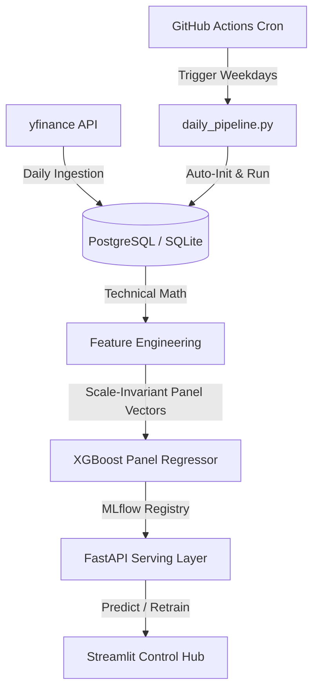

# 🔮 S&P 30 MLOps Predictor: The Quant Alchemist 🔮

[](http://127.0.0.1:8000)
[](http://127.0.0.1:8501)
[](./mlruns)
[](./monitoring/drift_report.html)

Welcome to the **S&P 30 MLOps Predictor**! This is a production-grade, scale-invariant machine learning forecasting machine. It concurrent-tracks and forecasts next-day closing returns across **30 of the most liquid assets in the S&P 500** index, all while monitoring data drift, evaluating prediction errors, and rendering a high-end dashboard.

---

## 🛠️ The Alchemy: Core System Features

### 1. 📏 Scale-Invariant Magic (Quant Best Practice)
How do you train one single ML model to simultaneously forecast Apple (\$190), Microsoft (\$420), and Bank of America (\$40)? 
* **The Problem**: Decision trees (like XGBoost) cannot extrapolate to absolute price values they've never seen before.
* **The Alchemy**: We transform all technical indicators (SMAs, Bollinger Bands, MACDs) into ratios relative to the asset's current close price (e.g., `SMA_5 / Close`).
* **The Target**: The model predicts **next-day percentage return** instead of absolute close:
  $$\text{Return} = \frac{\text{Close}_{t+1} - \text{Close}_t}{\text{Close}_t}$$
* **The Reconstruction**: At serving time, FastAPI scales back the prediction to absolute price:
  $$\text{Predicted Close}_{t+1} = \text{Close}_t \times (1 + \text{Predicted Return})$$

### 2. ⚡ Latency-Optimized Parallel Pipelines
Seeding **22,500 daily price records** and **21,030 feature records** from scratch?
Our optimized pipeline uses **in-memory key indexing** and **batch-insertion (`executemany`)**. This avoids N network roundtrips over the internet to cloud databases (like Render/Supabase), compressing initial data setup and updates from **53 minutes down to under 15 seconds!**

### 3. 🧪 Continuous Integrity & Validation
* **Yesterday vs. Today**: Every weekday evening, the pipeline evaluates yesterday's forecasts against today's actual closes. It calculates absolute error ($) and directional accuracy (was it correctly predicted UP or DOWN?).
* **Degradation Detection**: Automatically monitors if the rolling 7-day MAE degrades by >15% compared to the 30-day baseline and flags warnings.
* **Data Drift Reports**: Uses Evidently AI to audit joint feature drift across the 30-stock panel, saving interactive HTML reports.

---

## 🏗️ Architecture Blueprint



---

## 🚀 Speedrun: Local Setup

### 1. Clone & Set Up Environment
```bash
# Set up Python virtual environment
python -m venv .venv
source .venv/bin/activate  # On Windows: .venv\Scripts\activate

# Install the dependencies
pip install -r requirements.txt
```

### 2. Run the Servers
Start the FastAPI server (port 8000) and the Streamlit Dashboard (port 8501) concurrently:
```bash
# Terminal 1: Launch API
python -m uvicorn serving.api:app --host 127.0.0.1 --port 8000

# Terminal 2: Launch Dashboard
streamlit run monitoring/dashboard.py
```

---

## ⚙️ CI/CD: Automated Pipelines
The workflow [.github/workflows/daily.yml](file:///.github/workflows/daily.yml) triggers automatically on weekdays at **6:05 PM ET** (after market close). 

To configure it in your GitHub repository:
1. Go to **Settings ➔ Secrets and variables ➔ Actions**.
2. Add your **`DATABASE_URL`** (use Render/Supabase's **External** connection URL) and **`API_URL`** (your hosted FastAPI endpoint).
3. Sit back and watch the runner collect data, predict, and log validation metrics autonomously!
